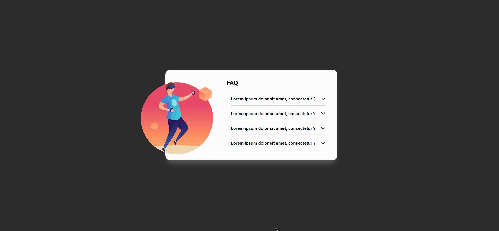

# Projeto Acordeon

## Visão Geral
Este projeto é um acordeon dinâmico e responsivo construído como exercício de um curso, baseado em um design fornecido no Figma. O objetivo do desafio era replicar o design utilizando HTML, CSS e JavaScript. Para aperfeiçoamento, adicionei efeitos de transição suave, tornando o projeto mais harmônico e moderno.

## Funcionalidades
- **Design Responsivo:** O layout se ajusta para telas móveis e desktops.
- **Animação:** Transições suaves ao expandir ou contrair as respostas do acordeon.
- **Navegação Simples:** Clique nas perguntas para revelar ou ocultar as respostas.
- **Exibição de Conteúdo:** Cada item do acordeon inclui uma pergunta e uma resposta descritiva.

## Tecnologias Utilizadas
- HTML
- CSS
- JavaScript

## Preview

[>> Acesse o Preview <<](https://guilherme-dev15.github.io/project-accordion/)